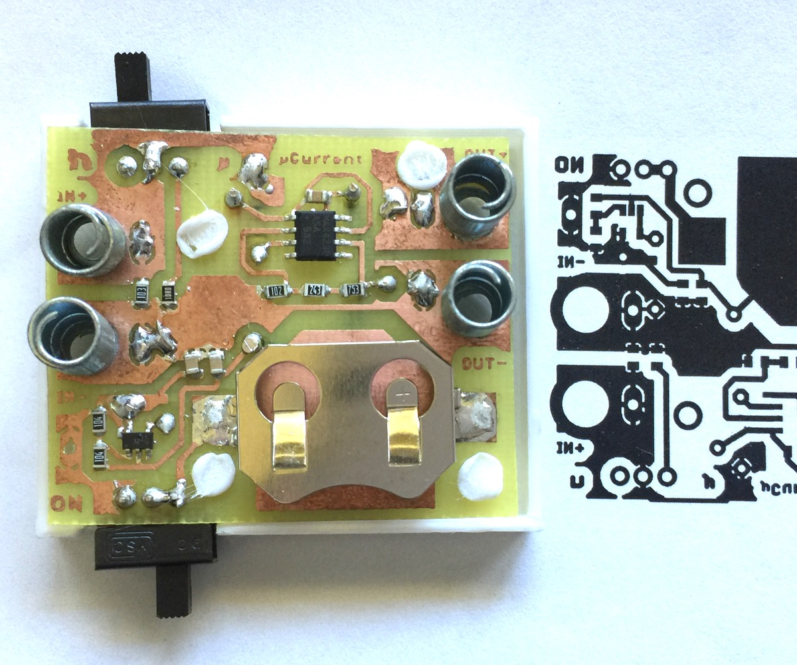
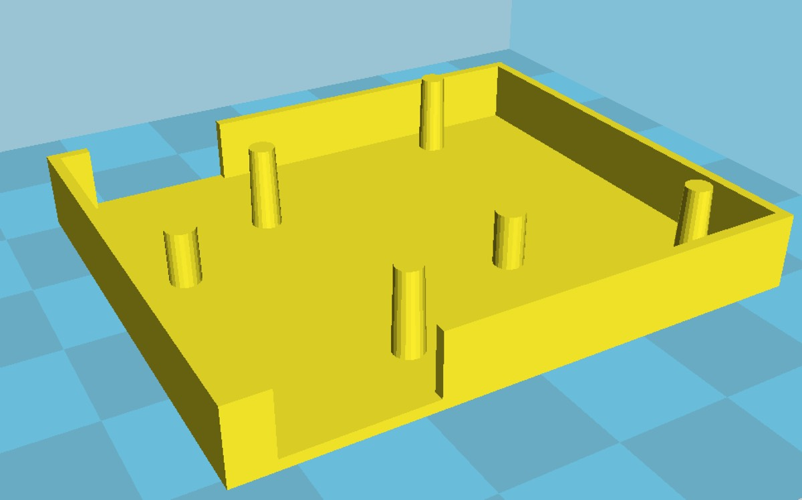
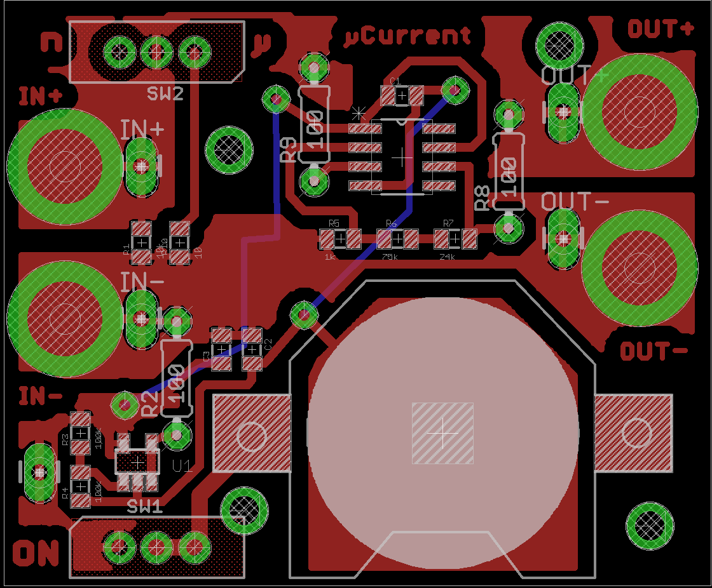

µCurrent
------------------

Based entirely on [µCurrent by David Jones at EEVBlog](https://www.eevblog.com/projects/ucurrent/). 

µCurrent allows accurate measurement of micro and nano amps with a low burden voltage by outputting one millivolt per micro/nano amp. See the link above for all kinds of awesome if you want to know more.

This is a slightly simplified variation on µCurrent that allows for measuring micro and nano amps only. I used DPST switches and remove the milli amp measurement and the battery test (I can just probe the battery). The board is layed out for single sided home PCB manufacuring. I used a few through hole resistors for the non precision components to avoid extra jumpers. 

I've included a 3D printed case as well. Just melt the tabs down once the PCB is in place.

Neat Stuff
----------------

The crazy thing is that you can measure very low current things, for example an LED will generate current! I got about 160na when pointed at an indoor light. My project running on a PIC10LF320 in sleep mode is using only 560na. Cool!

You can also hook this up to a scope for even more sensitive measurements and detail. The amplifier used is very accurate and low noise.

Parts List
--------------

Part | precision | size | qty
---- | ----------| ---  | ----
100R | 5%        | 1/4w | 3
100K | 1%        | 0805 | 2
1K   | 0.1%      | 0805 | 1
75K  | 0.1%      | 0805 | 1
24K  | 0.1%      | 0805 | 1
10K  | 0.1%      | 0805 | 1
10R  | 0.1%      | 0805 | 1
100nF Capacitor|         | 0805 | 3
SPDT Slide Switch|  | PCB .1" | 2
Lithium Battery | | CR2032 |1
SMT Battery holder [mouser part](http://www.mouser.com/ProductDetail/Linx-Technologies/BAT-HLD-001/) | | 20mm| 1
MAX4239ASA+ Opamp|  | SO8 | 1 
LMV321AS5X Opamp |  | SOT23-5 | 1

I used some springs I scavenged from some old RadioShack learn electronics kits instead of banana jacks or binding posts.
